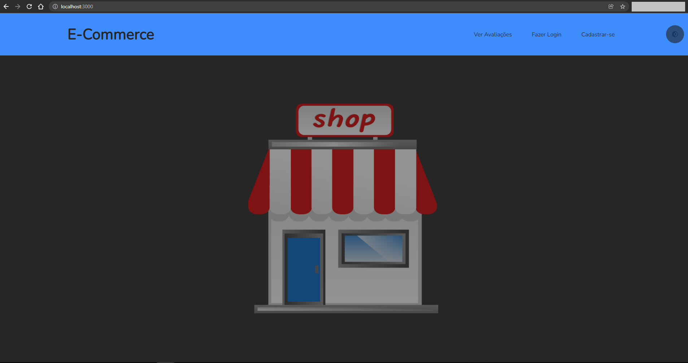
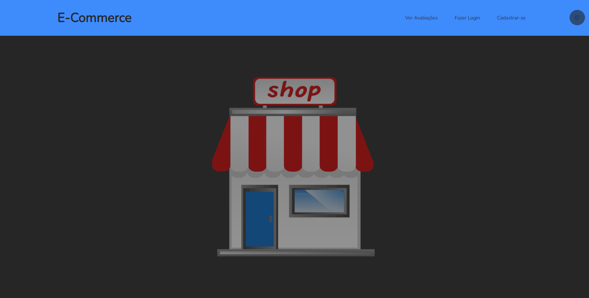
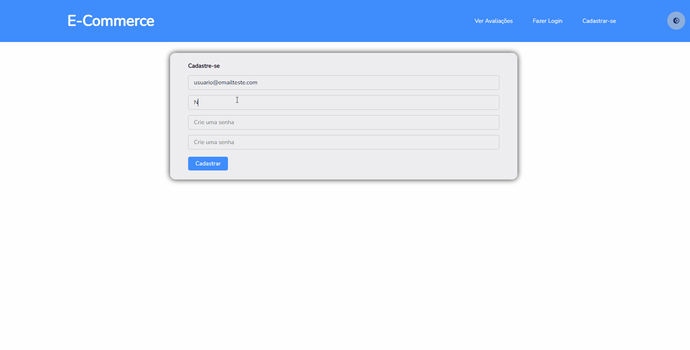

# E-commerce Feedbacks

  Project simulating the implementation of an login/signup and users feedback interfaces to an generic E-commerce platorm. 

## Technologies

  This projet was developed using the following technologies:

 #### Back-end
- [NodeJS](https://nodejs.org/)
- [ExpressJS](https://expressjs.com/)
- [React](https://reactjs.org/)
 
 #### Front-end
- [React](https://reactjs.org/)
- [TypeScript](https://www.typescriptlang.org/)
- [Styled-Components](https://styled-components.com/)

## About the Project

  This projet was developed from the "Bootcamp Inter Developer" offered by the Teaching Platform [Digital Innovation One](https://digitalinnovation.one/) together with [Banco Inter](https://www.bancointer.com.br/).

## Application Demos

  #### Home / Landing page
  
  
  #### Navigation throgh the screens (not logged)
  

  #### Creating profile, logging and leaving a feedback
  
